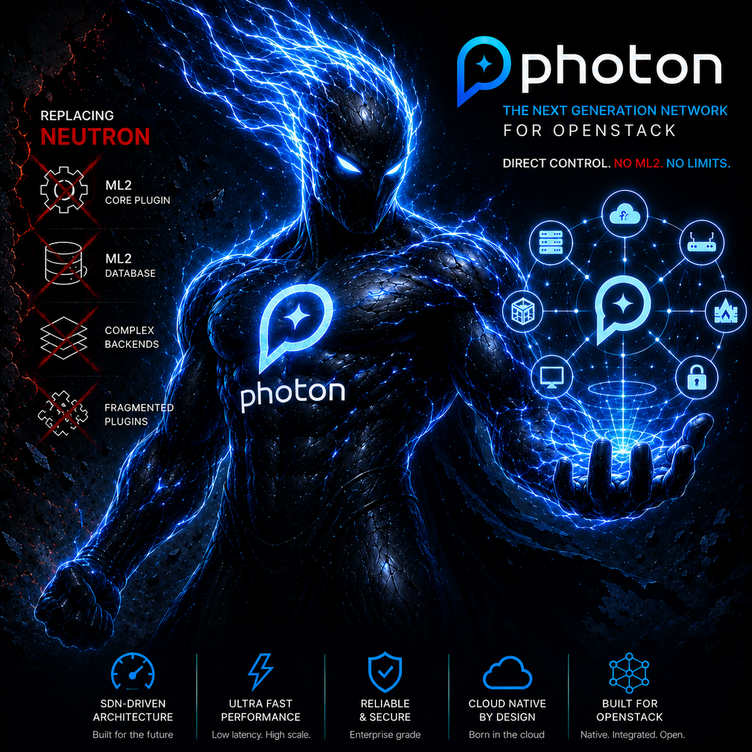

# Photon SDN

  

Photon SDN develops modern cloud networking solutions focused on performance, scalability, reliability, and OpenStack integration.

The project provides a new SDN architecture for cloud environments, designed to handle large-scale deployments with high request throughput and efficient network management.

Photon is compatible with OpenStack and is designed to replace the Neutron core networking plugin, moving network control logic into a dedicated SDN controller built with a modern and scalable architecture.

## Focus

* Modern SDN architecture for cloud networking
* OpenStack integration
* Replacement of the existing Neutron SDN implementation with a high-performance SDN controller
* Reliable and high-performance network management
* Scalability for large cloud environments
* Fast API request processing

Photon SDN — modern networking infrastructure for scalable cloud platforms.

